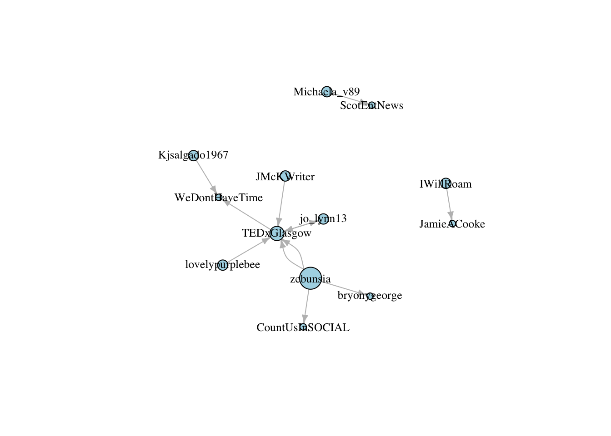

  author: Jonathan Lau 

# Key info  
> ***Brief***  
Support #countusin effort via social media analysis, identifying key influencers and engagement  

* [#countusin](https://www.count-us-in.org/project/)  
* [TEDxGlasgow](https://tedxglasgow.com/about)
* [COP26](https://www.ukcop26.org) 
* [UNSDG](https://www.un.org/sustainabledevelopment/sustainable-development-goals/)  
* [Countdown](https://countdown.ted.com/get-informed)  
* [Future Stewards](https://futurestewards.com)  

# Identification and engagement  
***Overview***  
1) Social media influencers  
2) Like-minded people  
3) Organisations / corporates    

## Identifying key influencers
* Analyse Twitter networks  
* Identify key hashtags, Twitter handles and timelines for analysis  
* Identify key methods of engagement  

> The users who retweet most will add more value if they have a high follower count as their retweets will reach a wider audience.

***Example network***  

> In a network plot, the combination of vertex size indicating the number of retweets by a user and vertex color indicating a high follower count provides clear insights on the most influential users who can promote a brand.

***Other Twitter Examples***    
* #Youth4ClimateLive  
* #COP26  
* @PreCop26ITA  
* @UNYouthEnvoy  
* @fatoulaminjeng1  
* @sophiakianni  
* @LouiseMabulo  
* @AminaJMohammed  

## Like-minded people  

This doesn't necessarily have to be 'Green activists' but people who can be inspired / whipped up to generate more momentum.

N.B. Is #countusin sign up use maximised for impact and virtuous recruitment?  
  
Previous TED speakers should already be highly engaged e.g. [TEDxGlasgow](https://tedxglasgow.com/climate)

## Organisations 

***Overview***   
The right organisations will be in a position to take a concerted stance on internal messaging to a lot of employees and externally in general (client) communications.  
  
  Consideration should be given to how much personal touch can be given versus something more blanket automated.  Perhaps there is a case-by-base compromise to be struck.  
  
  What can we do to make participation even more attractive?  What is the 'welcome pack' like?  

***Initial sources***  
* Companies house - on-brand CSR efforts, sectors, employee sizes, create list of CSR officers / senior contacts  
* Charities register - not exlusively climate related.  Climate change effects everyone!  
* Historic conference / initiatives participation  
* Existing parters of [#countusin](https://www.count-us-in.org/partners/)  
* Existing hubs of [#countusin](https://www.count-us-in.org/hubs/)   

***Examples***   
* @UNFCCC  
* @IPCC  
* @Ikea

# Key data to collate  
* Themes  
* Topics  
* Contact details  
* Profiles  
* Keywords / hashtags  
* Followers  
* Retweets  

# Key activities and execution
Finding ways to encourage people to pledge with us.

Finding climate action and sustainability stories from people and organisations we could share.

Building a model that helps us target our marketing to meet those audience's is what would be super.

# Data  
* Key information to collect  
* Key topics and hashtags  
* GDPR  
* Consent  
* ***Do Nation***  
* ***Leaders Quest Foundation***  
* ***Twitter policies***  
* Transparency versus 'too open'  
* Keeping track of engagements and activity

# Considerations
* Geographic concentration  
* Facebook / Instagram  
* Branding / messaging / communication channels   
* Is there anything that can be simplified?  Facts versus ideas  
* Is there anything that we can learn from good sales people?  
* How can external individuals / organisations help to spread the word?   
* What makes a good story / meme / message in terms of dissemination and call to action?
* Referrals.  How can we leverage others' networks?    
* Content / media nature and frequence    
* Paid promotion
* Database management  
* Scalability and automation of activities  

 